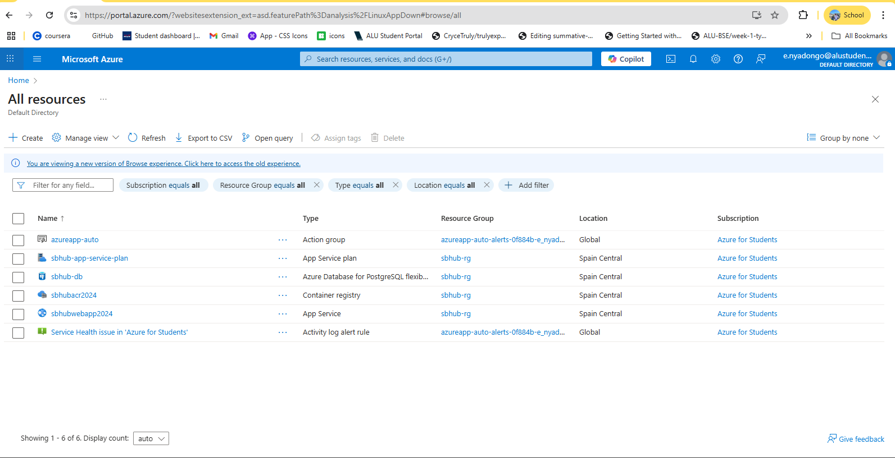
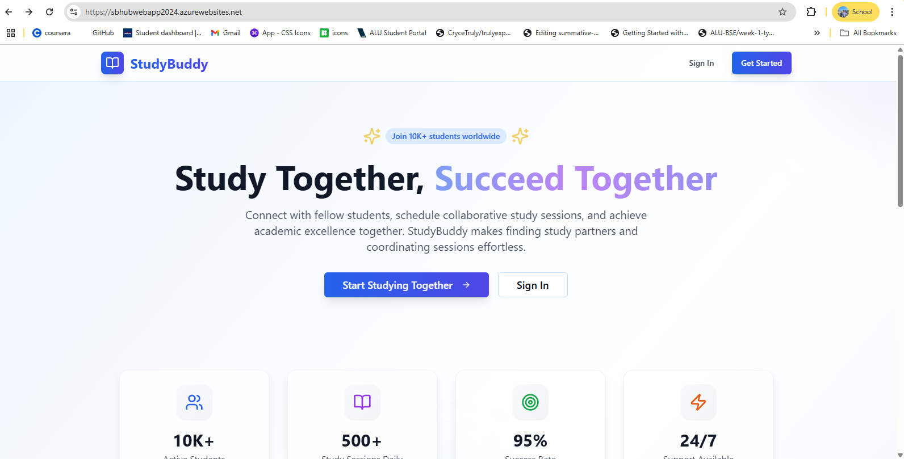
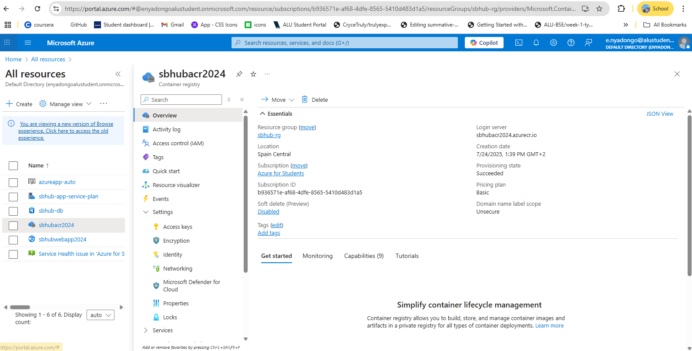
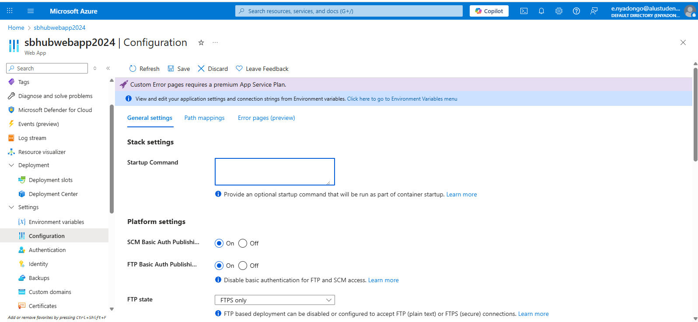

# Phase 2 Submission

## Live Public URL

**https://sbhubwebapp2024.azurewebsites.net**

---

## Screenshots of Provisioned Resources

**Required Screenshots:**
1. Azure Resource Group showing all resources (Database, Container Registry, Web App)
2. Azure Container Registry with your Docker image
3. Azure Web App configuration and setting
4. Your application running in browser at the live URL
5. Database connection working (if you can show this)

**Azure Resources Overview:**

*This screenshot shows all provisioned Azure resources including:*
- **sbhub-db**: PostgreSQL Flexible Server (Database)
- **sbhubacr2024**: Azure Container Registry 
- **sbhubwebapp2024**: Web App for Containers
- **sbhub-app-service-plan**: App Service Plan
- All resources in **sbhub-rg** resource group, **Spain Central** region

**Live Application Screenshot:**

*This screenshot shows the Session Buddy Hub application running successfully in the browser at the live URL.*

**Azure Container Registry Screenshot:**

*This screenshot shows the Azure Container Registry (sbhubacr2024) overview. The registry contains the Docker image "session-buddy-hub:latest" which was successfully pushed and is being used by the web application. The login server "sbhubacr2024.azurecr.io" is used for Docker push/pull operations.*

**Docker Image Verification:**
- **Repository:** session-buddy-hub
- **Tag:** latest
- **Status:** Successfully pushed and deployed
- **Registry:** sbhubacr2024.azurecr.io

**Azure Web App Configuration Screenshot:**

*This screenshot shows the Azure Web App (sbhubwebapp2024) Configuration page with General settings. The web app is configured for container deployment with platform settings for SCM and FTP authentication enabled. The startup command field is available for custom container startup instructions.*

---

---
## Reflection

*My experience with Infrastructure as Code (IaC) using Terraform and the manual deployment process has been both challenging and enlightening. Initially, I found the concept of defining infrastructure through code to be quite abstract, but as I worked through the process, I began to appreciate its power and efficiency.

The biggest challenges I encountered were related to Azure-specific configurations and regional restrictions. I learned that Azure has strict policies about which regions can be used, and I had to adapt my Terraform configuration from the default region to `spaincentral` to comply with Azure's policy requirements. This taught me the importance of understanding cloud provider constraints and the value of IaC in quickly adapting to such requirements. Additionally, I faced issues with Node.js module systems when transitioning from CommonJS to ES modules, which required significant debugging and code refactoring to ensure compatibility with the containerized environment.

The manual deployment process revealed the complexity of modern application deployment. I learned that containerization with Docker is not just about packaging an application, but also about understanding the runtime environment, file paths, and static asset serving. The most valuable lesson was the importance of iterative debugging - each issue we encountered (CORS configuration, static file serving, trust proxy settings) required careful analysis of logs and systematic problem-solving. This experience has given me a much deeper appreciation for DevOps practices and the importance of proper infrastructure management in modern software development. I would approach future deployments with more thorough testing of the containerized application locally before pushing to production, and I would implement better logging and monitoring from the start to facilitate debugging. 
